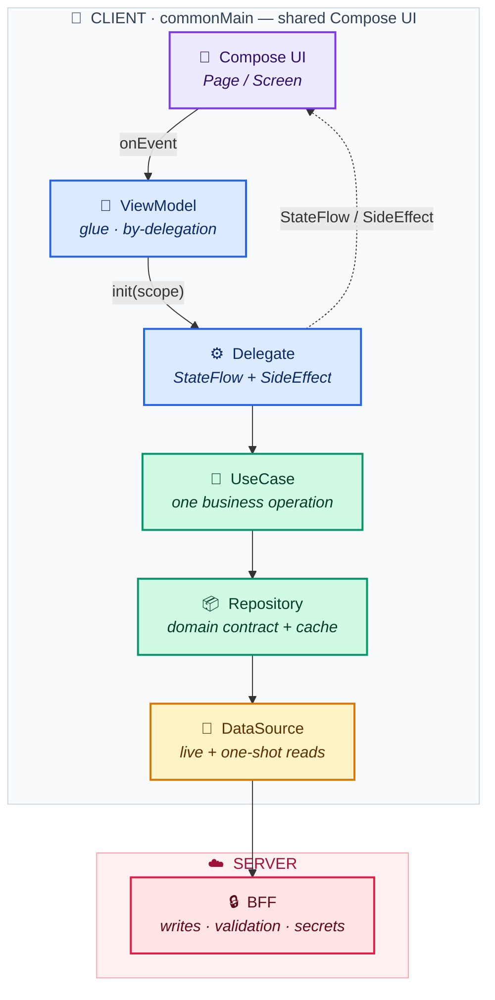

# KMP Architecture Skill

A proven, production-tested architecture for **Kotlin Multiplatform (KMP)** apps
that share their **UI** with **Compose Multiplatform (CMP)** — one Compose codebase
running on Android and iOS — plus a clean data layer and a Backend-for-Frontend
(BFF) boundary.

This repo is packaged as an **Agent Skill**: drop it into your agent's skills
folder and your coding agent will scaffold new screens and features following the
same patterns. It's also just a readable architecture guide if you're not using an
agent.

```
ViewModel → Delegate → UseCase → Repository → DataSource → BFF / Server
```



## Why this exists

Most KMP examples stop at "shared business logic, native UI per platform." This
goes further: the **UI is shared too** (Compose Multiplatform), and the layers
below it are structured so a solo dev can ship and maintain a real app on both
stores from one codebase.

The patterns come from a real shipped app (Android + iOS, one Compose codebase).
Everything here is the *shape* of the architecture — no business logic, no secrets.

## KMP vs CMP — the distinction this skill is built on

- **KMP** shares *business logic*. Each platform keeps its native UI (SwiftUI on
  iOS, Compose on Android) — you build every screen twice.
- **CMP** shares the *UI too*. You write screens once in Compose; they run on both.

This skill assumes **CMP**: shared UI is the substance, "KMP" is the umbrella term.

## What's inside

```
SKILL.md                          The skill entry point: when to apply + the core model
references/
  mvvm-delegate-bff.md            ViewModel → Delegate → UseCase → Repository → DataSource → BFF
  module-structure.md             commonMain / androidMain / iosMain + per-feature layering
  koin-di.md                      Koin module split, single vs factory vs viewModelOf
  type-safe-navigation.md         @Serializable routes + generic composable<Route>
  data-flow-rules.md              Live listeners, one-shot reads, why writes go through the BFF
examples/
  DelegateTemplate.kt             Interface + impl skeleton (state + side effects, calls a UseCase)
  ViewModelTemplate.kt            Single- and multi-delegate composition via `by`
  UseCaseTemplate.kt              One business operation — interface + impl
  RepositoryTemplate.kt           Domain interface + data impl
  DataSourceTemplate.kt           Live listener + one-shot read
assets/
  data-flow.mmd                   Mermaid source for the data-flow diagram
```

## Use it as an Agent Skill

**Claude Code / agents that read `.claude/skills/`:**

```bash
git clone https://github.com/<your-username>/kmp-architecture-skill
cp -r kmp-architecture-skill ~/.claude/skills/kmp-architecture
```

Then ask your agent to "scaffold a new feature using the kmp-architecture skill"
and it will follow the layering, naming, and state conventions.

**Cursor / other agent tools:** point your rules/skills config at this folder, or
just paste `SKILL.md` into context.

## Use it as a guide

Start with [`SKILL.md`](SKILL.md) for the model and the rules, then read the
`references/` deep dive for the layer you're working on and copy the matching
`examples/` skeleton.

## The non-negotiables

1. Never skip a layer (ViewModel never calls a UseCase or Repository directly).
2. The ViewModel owns the only real `CoroutineScope`; delegates borrow it.
3. State is always private `MutableStateFlow` → public `StateFlow`.
4. All writes go through the BFF; the client never mutates the DB directly.
5. One live listener per source of truth; everything else is a one-shot read.
6. `expect/actual` is for platform-bound concerns only.

## License

MIT — see [LICENSE](LICENSE). Use it, fork it, adapt it.
