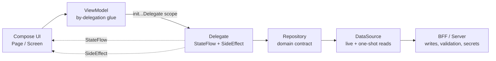

# KMP Architecture Skill

A battle-tested architecture for **Kotlin Multiplatform (KMP)** apps that share
their **UI** via **Compose Multiplatform (CMP)** — one Compose codebase running on
Android and iOS — with a clean data layer and a Backend-for-Frontend boundary.

> **KMP vs CMP:** KMP shares *business logic* (each platform keeps its native UI —
> SwiftUI on iOS, Compose on Android, so you build every screen twice). CMP shares
> the *UI too* — you write the screens once in Compose and they run on both. This
> skill assumes CMP: the substance is shared UI, and "KMP" is the umbrella keyword.

## When to apply

Use this skill when you are:

- Starting a new KMP/CMP app or feature and want a structure that scales.
- Writing a `ViewModel` and unsure how to split logic out of it.
- Wiring state flows, one-time UI events, or coroutine scopes.
- Structuring `commonMain` / `androidMain` / `iosMain` source sets.
- Setting up Koin DI for ViewModels, delegates, repositories.
- Adding type-safe navigation between screens.
- Deciding what belongs on the client vs behind the BFF.

## The core idea

```
ViewModel  →  Delegate  →  Repository  →  DataSource  →  BFF / Server
  (glue)    (business     (domain        (live reads +   (all writes,
            logic +        contract +     one-shot         validation,
            state)         caching)       reads)           secrets)
```

Each layer has one job and never reaches past its neighbor:

- **ViewModel** — pure glue. Owns no state of its own. Composes one or more
  **Delegates** with Kotlin `by` delegation and wires their lifecycle to
  `viewModelScope`. Never calls a Repository directly.
- **Delegate** — encapsulates the business logic for a slice of a screen. Owns a
  `StateFlow<State>` and a `Flow<SideEffect>`. Receives its `CoroutineScope` via
  `initFooDelegate(scope)` — it never creates its own scope.
- **Repository** — the domain contract (interface in `domain/`, impl in `data/`).
  Exposes a private `MutableStateFlow` as an immutable `StateFlow`. Reads directly,
  routes **all mutations through the BFF**, wraps them in `Result`.
- **DataSource** — owns the live data connection. Real-time reads use a single
  cancellable listener (one source of truth, deduped by id); point reads use
  one-shot `get()`.
- **BFF / Server** — every write, every validation, every security-sensitive
  calculation. The client is "dumb": it renders state and forwards intent.



## The rules that matter

1. **Never skip a layer.** A ViewModel that calls a Repository, or a Composable
   that calls a DataSource, breaks the contract.
2. **The ViewModel owns the only real scope.** Delegates borrow `viewModelScope`
   through their `init` function. A delegate that creates its own
   `CoroutineScope` leaks.
3. **State exposure is always private-mutable → public-immutable.** Private
   `MutableStateFlow` → public `StateFlow` via `.asStateFlow()`. One-time events
   via `Channel` → `Flow` via `.receiveAsFlow()`.
4. **All writes go through the BFF.** The client never mutates the database
   directly. Mutations are server functions returning `Result<T>`. The backend
   SDK type never appears in `domain/`.
5. **One live listener per source of truth.** Continuous data is owned by a single
   DataSource listener, deduped by id. Everything else is a one-shot read.
6. **`expect/actual` is for platform-bound concerns only** — platform info,
   permissions, pickers, social auth, media, share, locale, DI platform module.
   Business logic and UI stay in `commonMain`.

## How the pieces fit — walkthrough

See `references/` for the deep dives and `examples/` for copy-paste skeletons:

- `references/mvvm-delegate-bff.md` — the full ViewModel → Delegate → Repository →
  DataSource → BFF flow, with the scope-ownership and state-exposure invariants.
- `references/module-structure.md` — `commonMain` / `androidMain` / `iosMain`
  layout, per-feature `domain` / `data` / `ui` layering, `expect/actual`.
- `references/koin-di.md` — module split, `singleOf(::Impl).bind(...)`, when to use
  `single` vs `factory` vs `viewModelOf`, qualifiers, platform module.
- `references/type-safe-navigation.md` — `@Serializable` routes, generic
  `composable<Route>`, typed args via `toRoute<T>()`.
- `references/data-flow-rules.md` — the hard-won rules about live listeners,
  one-shot reads, and why every write goes through the BFF.

- `examples/DelegateTemplate.kt` — interface + impl skeleton.
- `examples/ViewModelTemplate.kt` — single- and multi-delegate composition.
- `examples/RepositoryTemplate.kt` — domain interface + data impl.
- `examples/DataSourceTemplate.kt` — live listener + one-shot read.

> The examples are **generic skeletons** (`Foo`/`Bar`) — the *shape* of each layer,
> with no business logic. Copy one, rename it, fill in the body.
