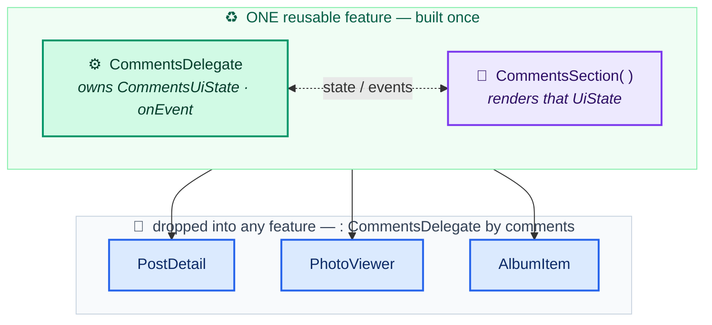

# MVVM + Delegate + BFF

The data flows top to bottom; state flows back up. Each layer talks only to its
direct neighbor.

```
ViewModel  →  Delegate  →  UseCase  →  Repository  →  DataSource  →  BFF / Server
```

## ViewModel — glue only

The ViewModel owns no state. It **composes delegates** with Kotlin `by` delegation,
re-exporting their `state` / `onEvent` / `sideEffects` to the UI, and wires their
lifecycle by calling each `init…Delegate(viewModelScope)` in `init`.

```kotlin
class FooViewModel(
    private val delegate: FooDelegate,
) : ViewModel(), FooDelegate by delegate {   // re-exports the delegate's surface
    init {
        delegate.initFooDelegate(scope = viewModelScope)
    }
}
```

The UI receives the ViewModel **typed as the delegate interface** — e.g.
`FooHomePage(viewModel: FooDelegate)`. The Composable never knows there's a
ViewModel; it only sees `state`, `onEvent`, `sideEffects`.

When a screen needs several independent concerns, compose multiple delegates:

```kotlin
class BarViewModel(
    private val fooDelegate: FooDelegate,
    private val bazDelegate: BazDelegate,
    private val barRepository: BarRepository,
) : ViewModel(),
    FooDelegate by fooDelegate,
    BazDelegate by bazDelegate {
    init {
        viewModelScope.launch {
            initBazDelegate(this)
            val barId = barRepository.getBarId()
            if (barId != null) initFooDelegate(this, barId)
        }
    }
}
```

> **Why a Repository call appears here:** resolving an *id* needed to start a
> delegate is lifecycle wiring, not business logic. The screen's actual logic still
> lives in the delegates.

### Delegate vs UseCase — not the same thing

This is the most common pushback, so be precise:

| | UseCase | Delegate |
|---|---------|----------|
| Holds state? | No — stateless | Yes — owns `StateFlow<UiState>` + side effects |
| Knows about UI? | No | Yes — paired with a Composable that renders its state |
| Shape | `operator fun invoke(input): Result<T>` | `state` / `sideEffects` / `onEvent` / `init(scope)` |
| Reused unit | a computation | a whole **UI feature** (state + behavior + its Composable) |
| Relationship | the Delegate **calls** UseCases | — |

Litmus test: *does a Composable render its state?* → it's a Delegate. *Is it a pure
operation that returns a value?* → it's a UseCase. A Delegate that calls
`PostCommentUseCase` is not a fancy UseCase; it's the stateful, UI-bound layer that
**uses** one.

### What the Delegate buys you: a reusable UI feature

Because the Delegate owns a `UiState` that a shared Composable renders, reusing the
delegate reuses the **whole feature** — identical UI *and* behavior — across screens.
A UseCase reuses a computation; a Delegate reuses a feature.



The comment thread is built **once**: `CommentsDelegate` owns `CommentsUiState` (the
list, the input box, the optimistic-send and paging state), `CommentsSection()`
renders it, and any screen gets the full feature by composing the delegate
(`by comments`) and dropping in the Composable. Post detail, the photo viewer, and
the album item all show the *same* comment UI and behavior.

Stack a few delegates into one ViewModel and the ViewModel collapses to a handful
of lines of glue — each concern owned by a delegate that's testable and reusable on
its own.

## Delegate — business logic + state

A delegate orchestrates the **UI state** for a slice of a screen and turns UI
intent into calls on **UseCases** — it does not hold the business rules itself. It
defines:

- `val state: StateFlow<FooState>` — the continuous UI state.
- `val sideEffects: Flow<FooSideEffect>` — one-time events (navigation, toasts).
- `fun onEvent(event: FooEvent)` — the single entry point for UI intent.
- `fun initFooDelegate(scope: CoroutineScope, …)` — receives the parent scope.

```kotlin
interface FooDelegate {
    val state: StateFlow<FooState>
    val sideEffects: Flow<FooSideEffect>

    fun onEvent(event: FooEvent)
    fun sendSideEffect(effect: FooSideEffect)

    fun initFooDelegate(scope: CoroutineScope, barId: String) {}
}
```

The impl holds private mutable state and a side-effect `Channel`, and captures the
scope in `init` — **never** in the constructor:

```kotlin
class FooDelegateImpl(
    private val repository: FooRepository,
) : FooDelegate {
    private val _state = MutableStateFlow<FooState>(FooState.Loading)
    override val state: StateFlow<FooState> = _state.asStateFlow()

    private val _sideEffects = Channel<FooSideEffect>()
    override val sideEffects: Flow<FooSideEffect> = _sideEffects.receiveAsFlow()

    private lateinit var scope: CoroutineScope   // set in init, NOT the constructor

    override fun initFooDelegate(scope: CoroutineScope, barId: String) {
        this.scope = scope
        // start collecting / initial load on the borrowed scope
    }

    override fun sendSideEffect(effect: FooSideEffect) {
        scope.launch { _sideEffects.send(effect) }
    }

    override fun onEvent(event: FooEvent) {
        // when (event) { ... } -> mutate _state, call repository, sendSideEffect(...)
    }
}
```

**Invariant:** the `CoroutineScope` is `lateinit` and borrowed from the ViewModel.
A delegate never builds its own scope — that would outlive the screen and leak.

## UseCase — one business operation

The common critique of the Delegate pattern is that the delegate turns into a junk
drawer of business logic. The **UseCase** layer answers it: the delegate owns *UI
state and effects*, the UseCase owns *what the operation actually does*.

A UseCase is **one operation**, named for it (`SaveFooUseCase`, `GetFeedUseCase`),
**stateless**, and **reusable** across delegates. It composes one or more
repositories, applies the business rules, and returns a `Result`. Convention: a
single `operator fun invoke(...)` so call sites read like a function.

```kotlin
interface SaveFooUseCase {
    suspend operator fun invoke(input: FooInput): Result<Foo>
}

class SaveFooUseCaseImpl(
    private val fooRepository: FooRepository,
    private val barRepository: BarRepository,
) : SaveFooUseCase {
    override suspend fun invoke(input: FooInput): Result<Foo> {
        if (input.label.isBlank())
            return Result.failure(IllegalArgumentException("label required"))
        val barId = barRepository.getBarId()
            ?: return Result.failure(IllegalStateException("no bar"))
        return fooRepository.saveFoo(input.copy(barId = barId))
    }
}
```

The delegate then depends on the UseCase, not the repository:

```kotlin
class FooDelegateImpl(
    private val saveFoo: SaveFooUseCase,
) : FooDelegate { /* onEvent -> scope.launch { saveFoo(input) ... } */ }
```

**Pragmatic exception — don't add ceremony.** If a delegate only needs to expose a
repository's `StateFlow` (a pure pass-through read), a dedicated UseCase adds
nothing — let the delegate use the repository directly. Reach for a UseCase when
there's a *real* operation: orchestration across repositories, validation, combining
sources, or mapping domain models to UI. The layer earns its place by being reused
and unit-tested; it shouldn't exist just to forward a call.

## Repository — domain contract + caching

The interface lives in `domain/` and knows nothing about the backend SDK. The impl
lives in `data/`, exposes a private `MutableStateFlow` as immutable, reads
directly, and routes **all mutations through the BFF** wrapped in `Result`.

```kotlin
// domain/
interface FooRepository {
    val foo: StateFlow<Foo?>
    suspend fun fetchFoo()
    suspend fun getFoo(): Foo?
    suspend fun saveFoo(input: FooInput): Result<Foo>
}

// data/
class FooRepositoryImpl(
    private val server: ServerClient,
) : FooRepository {
    private val _foo = MutableStateFlow<Foo?>(null)
    override val foo: StateFlow<Foo?> = _foo.asStateFlow()

    override suspend fun fetchFoo() {
        if (foo.value != null) return                 // cache guard
        _foo.value = getFoo()
    }

    override suspend fun getFoo(): Foo? =
        server.collection("foos").document(currentId()).get().data()

    override suspend fun saveFoo(input: FooInput): Result<Foo> = runCatching {
        server.callFunction("saveFoo").invoke(input)   // mutation via the BFF
    }
}
```

## DataSource & BFF

See `data-flow-rules.md` for the DataSource listener rules and why every write goes
through the BFF.

## The invariants, in one place

- ViewModel composes delegates with `by`; owns the only real scope.
- Delegate owns `StateFlow<State>` + `Flow<SideEffect>`; borrows the scope via `init`;
  calls UseCases, not repositories (except trivial pass-through reads).
- UseCase is one stateless, reusable business operation (`operator fun invoke`);
  business rules live here, not in the delegate.
- State is always private `MutableStateFlow` → public `StateFlow` (`.asStateFlow()`);
  one-time events are `Channel` → `Flow` (`.receiveAsFlow()`).
- Mutations return `Result<T>` and run through the BFF; the backend SDK never
  appears in `domain/`.
